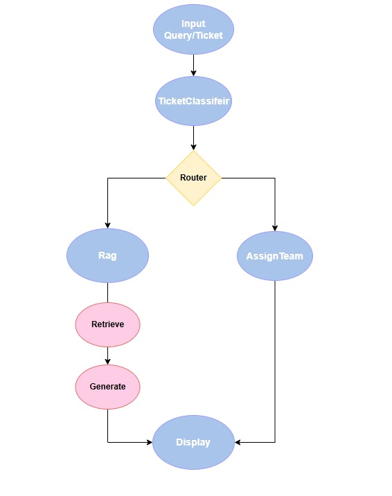
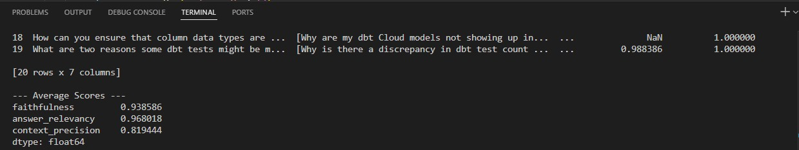

# AI-Powered Customer Support Copilot
## Major Design Decisions and Trade-offs for the AI Pipeline

## Overview
The AI pipeline is designed to classify customer support tickets and route them to the appropriate team or generate relevant answers using a Retrieval-Augmented Generation (RAG) approach. Below, we outline the major design decisions and trade-offs made during the development of this pipeline.

---

## Design Decisions

### 1. **Classifier Node**
The pipeline begins with a classifier node that processes incoming tickets. The classifier uses a large language model (LLM) to analyze the ticket content and classify it into one or more topic tags. 

#### Key Features:
- **Input:** The classifier takes tickets from `sample_tickets.json`.
- **Prompt Design:** The LLM is provided with a detailed prompt that specifies how to handle various scenarios. This ensures that the classification is robust and context-aware.
- **Multiple Topic Tags:**
  - The problem statement did not specify whether a ticket should belong to one or multiple topic tags.
  - **Decision:** We opted for multiple topic tags as it made more sense in real-world scenarios where a ticket could span multiple topics. For example, a ticket might involve both "API/SDK" and "Product" issues.

#### Trade-offs:
- **Complexity vs. Simplicity:** Allowing multiple topic tags increases the complexity of the classification logic but provides a more nuanced understanding of the ticket.
- **Accuracy vs. Speed:** Classifying multiple tags may slightly increase processing time but ensures higher accuracy in routing.
- **LLM Limitations:** While the prompt is highly descriptive, the LLM might misclassify edge cases or hallucinate, especially in ambiguous scenarios. This trade-off was accepted to leverage the LLM's ability to handle diverse and complex inputs.

---

### 2. **Routing Logic**
Once the topics are classified, the ticket is routed in real-time to either the RAG node or the `TicketRouter` node. The `TicketRouter` node ensures that the ticket is directed to the appropriate team based on the classified topics.

#### Key Features:
- **Dynamic Routing:** The routing logic dynamically determines the next step based on the classified topics.
- **Fallback Mechanism:** If no suitable subgraph is found, the ticket is routed to a default node.

#### Trade-offs:
- **Flexibility vs. Predictability:** Dynamic routing adds flexibility but requires robust error handling to manage edge cases.

---

### 3. **RAG Node**
The RAG node is responsible for generating answers using a Retrieval-Augmented Generation approach. This involves retrieving relevant documents and generating context-aware responses.

#### Key Features:
- **Model Choice:**
  - **OpenAI GPT-4-o-mini:** This model was chosen for its balance between performance and cost. It provides high-quality responses while being computationally efficient.
- **Embeddings Model:**
  - **OpenAI text-embedding-3-small:** This model was selected for generating embeddings due to its smaller size and efficiency, making it suitable for real-time applications.
- **Database:**
  - **Pinecone:** Pinecone was chosen as the vector database for its cloud-based architecture, scalability, and ease of integration.
- **Chunking Method:**
  - **Text Splitting:** Documents are split into chunks using the Recursive Character Text Splitter. This method ensures that the chunks are of manageable size (e.g., 1000 characters with 200-character overlap) for efficient retrieval and processing.

#### Trade-offs:
- **Model Performance vs. Cost:** While GPT-4-o-mini is not the most powerful model, it offers a good trade-off between performance and cost.
- **Embedding Size vs. Accuracy:** The smaller embedding model sacrifices some accuracy for faster processing and lower resource usage.
- **Database Choice:** Pinecone’s cloud-based nature ensures scalability but introduces dependency on external infrastructure.
- **Chunking:** Smaller chunks improve retrieval accuracy but increase the number of queries to the database.

---

## Conclusion
The design of this AI pipeline balances accuracy, efficiency, and scalability. Each decision, from allowing multiple topic tags to choosing specific models and databases, was made to ensure that the system meets real-world requirements while remaining cost-effective and robust. The trade-offs highlight the careful consideration given to each component to optimize the overall performance of the pipeline.

---

## System Architecture

### Overview
Below is an architecture diagram illustrating how the components of the system interact. The diagram provides a high-level view of the flow from the user interface to the backend components.




### Component Interaction

1. **Streamlit UI:**
   - The user interacts with the system through a Streamlit-based user interface.
   - The user inputs a question or ticket, which is then passed to the backend for processing.

2. **Graph Execution:**
   - The Streamlit UI invokes the graph, which orchestrates the flow of the pipeline.
   - The graph begins execution at the first node, `TicketClassifier`.

3. **TicketClassifier Node:**
   - This node classifies the ticket into one or more topic tags, sentiment, and priority using an LLM.
   - The classification results determine the next step in the pipeline.

4. **Routing Logic:**
   - Based on the topic tags, the ticket is routed to either the `RAG` node or the `TicketRouter` node.

5. **RAG Node:**
   - If the ticket is routed to the `RAG` node, the system retrieves relevant documents and generates an answer using the RAG approach.
   - The generated answer is displayed on the Streamlit UI.

6. **TicketRouter Node:**
   - If the ticket is routed to the `TicketRouter` node, the system generates a response indicating that the ticket has been classified and routed to the appropriate team.
   - For example: "This ticket has been classified as a 'Connector' issue and routed to the appropriate team."

7. **Streamlit UI (Output):**
   - The final answer, whether generated by the `RAG` node or the `TicketRouter` node, is displayed to the user on the Streamlit UI.

---

## Setting Up the Environment and Running the Project Locally

### Steps to Run the Project Locally

1. **Clone the Repository:**
   ```bash
   git clone https://github.com/Rishijain2003/Atlan_Customer_Support.git
   cd Atlan_Customer_Support
   ```

2. **Create and Activate a Virtual Environment:**
   - On Windows:
     ```bash
     python -m venv atlan_virtual_env
     .\atlan_virtual_env\Scripts\activate
     ```
   - On macOS/Linux:
     ```bash
     python3 -m venv atlan_virtual_env
     source atlan_virtual_env/bin/activate
     ```

3. **Install Requirements:**
   ```bash
   pip install -r customer_support/requirements.txt
   ```

4. **Set Up Environment Variables:**
   - Create a `.env` file in the project root directory.
   - Add the required environment variables (e.g., `Openai_api_key`, `pinecone_api_key`, `PINECONE_ENV`).

5. **Run the Application:**
   - From the project root directory:
     ```bash
     streamlit run customer_support/app.py
     ```
   - Alternatively, navigate to the `customer_support` directory and run:
     ```bash
     cd customer_support
     streamlit run app.py
     ```

6. **Run Bulk Ticket Classification:**
   - From the project root directory:
     ```bash
     python -m classifier.classifier
     ```

---

### Steps I took to make the vector database and then run the application 

1. **Bulk Ticket Classification:**
   - Follow the steps above to set up the environment.
   - Run the bulk ticket classifier:
     ```bash
     python -m classifier.classifier
     ```

2. **Run the Web Crawler:**
   - Execute the crawler script to collect URLs:
     ```bash
     python customer_support/crawler.py
     ```

3. **Validate URLs:**
   - Validate the collected URLs:
     ```bash
     python customer_support/validate_urls.py
     ```

4. **Ingest Vector Database:**
   - Build the vector database:
     ```bash
     python customer_support/ingest.py
     ```

5. **Run the Streamlit Application:**
   - Finally, launch the Streamlit application:
     ```bash
     streamlit run customer_support/app.py
     ```

---

## Ragas Evaluation

### Evaluation Process

For evaluation, the Ragas library was used. The evaluation process involved the following steps:

1. **Dataset Creation:**
   - The script `dataset_creation_for_ragas_evaluation.py` was executed to prepare the dataset for evaluation.

2. **Running Ragas Evaluation:**
   - The script `ragas_evaluator.py` was executed to evaluate the dataset using the Ragas library.

### Metrics Used

The following metrics were used during the evaluation:
- **Faithfulness**
- **Answer Relevancy**
- **Context Precision**

### Ragas Evaluation Results

Below is an example of the terminal output from the Ragas evaluation:


