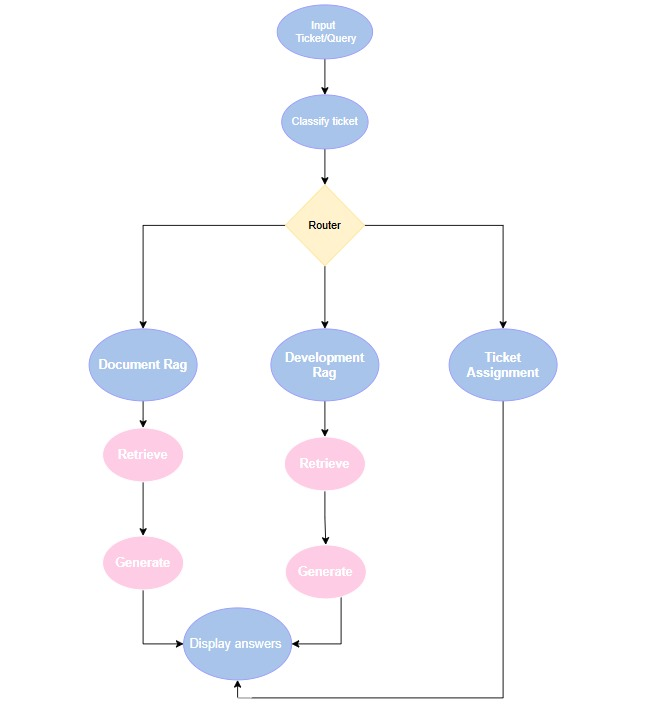

# AI-Powered Customer Support Copilot

## Overview
This project is an AI-powered helpdesk system that classifies, routes, and answers customer support tickets using Retrieval-Augmented Generation (RAG) and LLMs. It leverages LangChain, Pinecone, and Streamlit for a modern, interactive support workflow.

## Major Design Decisions & Trade-offs

### 1. *Retrieval-Augmented Generation (RAG) Pipeline*
- *Why RAG?*
  - RAG combines LLMs with a vector database to ground answers in real documentation, reducing hallucinations and improving factuality.
- *Trade-off:*
  - Requires maintaining up-to-date vector stores and handling retrieval latency, but provides more reliable, source-cited answers.

### 2. *Ticket Classification & Routing*
- *LLM-based Classification:*
  - Uses a structured prompt and Pydantic models to extract ticket subject, topic, sentiment, and priority.
  - Ensures consistent, explainable routing to the right subgraph (developer/docs/other).
- *Trade-off:*
  - LLMs may misclassify edge cases; prompt engineering and model selection are critical.

### 3. *Graph-based Workflow (LangGraph)*
- *Why Graphs?*
  - Modular, extensible pipeline: easy to add new nodes (e.g., escalation, feedback).
  - Conditional routing based on classification output.
- *Trade-off:*
  - More complex than a linear pipeline, but enables robust, production-grade flows.

### 4. *Environment & Secrets Management*
- *Streamlit Secrets:*
  - API keys and environment variables are managed via st.secrets for local/dev security.
- *Trade-off:*
  - Requires Streamlit for all runs; for pure backend, would use .env or a secrets manager.

### 5. *Bulk & Interactive Modes*
- *Bulk Classification:*
  - Supports batch processing of tickets for dashboarding and analytics.
- *Interactive Agent:*
  - Real-time ticket submission and response for demo and live support.

## Setup & Local Development

### 1. *Clone the Repository*
sh
git clone https://github.com/Rishijain2003/Atlan_Customer_Support.git
cd Atlan_Customer_Support

### 2. *Create and Activate Virtual Environment*
sh
python -m venv atlan_virtual_env
atlan_virtual_env\Scripts\activate  # On Windows
# Or
source atlan_virtual_env/bin/activate  # On Mac/Linux

### 3. *Install Dependencies*
sh
pip install -r customer_support/requirements.txt

### 4. *Set Up API Keys*
- Add your OpenAI and Pinecone API keys to .streamlit/secrets.toml or to .env and comment out the os.getenv one and comment the st.secret line:

toml
[general]
Openai_api_key = "YOUR_OPENAI_KEY"
pinecone_api_key = "YOUR_PINECONE_KEY"
PINECONE_ENV = "YOUR_PINECONE_ENV"

### 5. *Crawl and Ingest Documentation*
- Crawl documentation and developer sites:
sh
cd customer_support
python crawler.py

- Build vector databases:
sh
python ingest.py

### 6. *Run the Streamlit App*
sh
streamlit run customer_support/app.py

- The app will open in your browser. You can submit tickets and view the AI's analysis and responses.

### 7. *Bulk Ticket Classification (Optional)*
- To classify tickets in bulk:
sh
python -m classifier.classifier

## File Structure

customer_support/
    app.py                # Streamlit UI
    crawler.py            # Web crawler for docs
    ingest.py             # Vector DB builder
    rag_builder.py        # RAG pipeline
    customer_support_agent.py # Main agent logic
    ...
classifier/
    classifier.py         # Bulk ticket classifier
    sample_tickets.json   #sample ticket file which was given with the problem statement
    sample_ticket_c.json  #sample tickets which ar eclassified in bulk
    ...

## Notes
- *Architecture diagram:* 

- For production, consider using a secrets manager and robust error handling.
- The system is modular—add new topic tags, subgraphs, or LLM models as needed.

---

For questions or contributions, open an issue or pull request on GitHub.
## Working, Approach, and Model/Tool Choices

### Application & UI
- The helpdesk UI is built entirely with *Streamlit* for rapid prototyping, interactivity, and ease of deployment.
- The application is deployed on *Streamlit Community Cloud* for public access and demonstration.
- *Deployed link:* [https://atlan-customer-support-copilot.streamlit.app/](https://atlan-customer-support-copilot.streamlit.app/)

### AI Logic: Classification & RAG Pipelines
- *Classification Pipeline:*
  - Uses OpenAI's LLMs (see below) with structured prompts and Pydantic models to extract ticket subject, topic, sentiment, and priority.
  - Ensures robust, explainable, and consistent ticket routing.
- *RAG Pipeline:*
  - Combines LLMs with a Pinecone vector database to ground answers in real documentation, reducing hallucinations and providing source-cited responses.
  - The pipeline is implemented using LangChain and LangGraph for modular, graph-based orchestration.

### Model Choices & Rationale
- *LLM Model:*
  - Chosen model: *OpenAI GPT-4o-mini* (or similar OpenAI models).
  - *Why OpenAI?*
    - Industry-leading performance for both classification and generative tasks.
    - Excellent support for structured output and prompt engineering.
    - Reliable, scalable, and easy to integrate with LangChain.
- *Embedding Model:*
  - Chosen model: *OpenAI text-embedding-3-small*.
  - *Why this embedding?*
    - High-quality, dense vector representations for semantic search and retrieval.
    - Embedding dimension: *1536* (chosen for compatibility and performance with Pinecone and OpenAI's latest models).
    - Balances speed, cost, and retrieval accuracy for production-scale RAG systems.

### Crawler, Ingestion, and RAG Flow
- *Crawling:*
  - The system starts by crawling four key documentation and developer URLs:
    - https://developer.atlan.com/
    - https://developer.atlan.com/getting-started/
    - https://developer.atlan.com/concepts/
    - https://docs.atlan.com/
  - The crawler recursively collects all reachable URLs from these seeds, normalizes them, and stores them in a set to ensure uniqueness (no duplicate URLs).
  - The final set of URLs is saved to a JSON file for downstream processing.
- *Ingestion:*
  - Using LangChain's WebBaseLoader, all crawled URLs are loaded and their content is split into manageable chunks.
  - Each chunk is embedded using the OpenAI text-embedding-3-small model (1536 dimensions).
  - The resulting embeddings are stored in a *Pinecone* cloud vector database for fast, scalable retrieval.
- *RAG Execution:*
  - When a user submits a question via the UI, it is passed to the graph-based pipeline.
  - The pipeline retrieves relevant context from Pinecone, then generates a source-cited answer using the LLM.
  - The response is returned to the UI, along with internal classification and routing details.

---